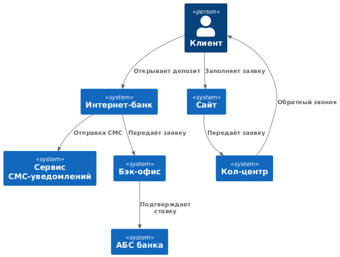
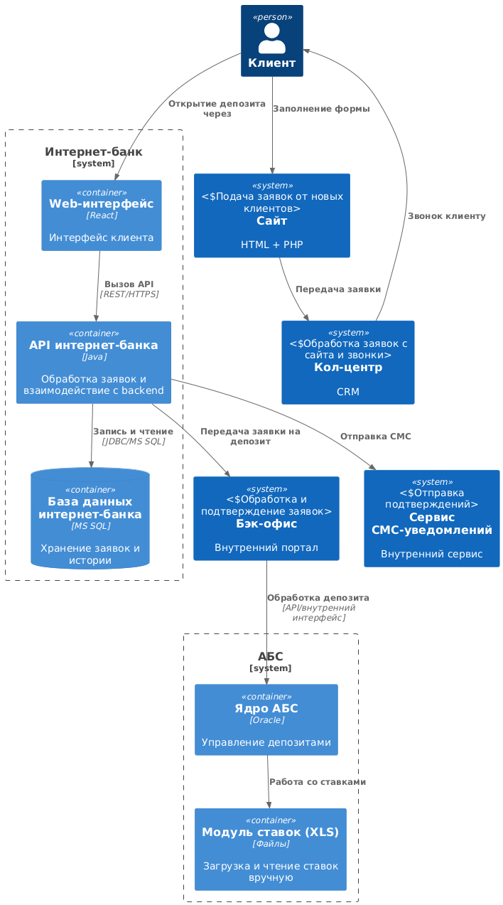

### **Название задачи:**
Открытие депозитов для MVP

### **Автор:**
Бирюков Н.А.

### **Дата:**
11-05-2025

### **Функциональные требования**
| № | Действующие лица или системы  | Use Case                  | Описание |
|---|-------------------------------|---------------------------|----------|
| 1 | Клиент (сайт)                 | Подача заявки на депозит  | Клиент вводит ФИО и телефон на сайте, заявка уходит в систему кол-центра |
| 2 | Менеджер кол-центра           | Обработка заявки          | Обзвон клиента, назначение персональных условий |
| 3 | Клиент (отделение)            | Прохождение идентификации | Новые клиенты идентифицируются в офисе |
| 4 | Клиент (интернет-банк)        | Открытие депозита         | Авторизованный клиент выбирает ставку и подаёт заявку |
| 5 | Бэк-офис                      | Подтверждение ставки      | Сотрудник бэк-офиса подтверждает депозит в АБС |
| 6 | Система СМС                   | Уведомление клиента       | Клиент получает СМС об открытии депозита |

### **Нефункциональные требования**
| № | Требование                                    |
|---|-----------------------------------------------|
| 1 | Использование шифрования трафика (HTTPS, TLS) |
| 2 | Высокая доступность (99.9%) |
| 3 | Масштабируемость интернет-банка (горизонтально) |
| 4 | Минимизация доработок ядра и СМС-функционала |
| 5 | Использование существующих технологий (MS SQL, Oracle, Kafka) |
| 6 | Разделение нагрузки: интернет-банк не обращается напрямую к АБС |
| 7 | Использование системы дизайна банка |
| 8 | Документирование архитектуры |
| 9 | Производительность: отклик в миллисекундах |

### **Решение**
#### Диаграмма контекста (C4 - Context)

#### Диаграмма контейнеров (C4 - Containers)

### **Альтернативы**
- Прямое подключение интернет-банка к АБС: просто, но перегружает ядро и нарушает доступность.
- Хранение ставок в отдельной БД: улучшает контроль, но требует согласований и синхронизации.

**Недостатки, ограничения, риски**
- Интернет-банк сейчас не масштабируется — ограниченный отклик.
- Централизация логики в бэк-офисе тормозит масштабируемость.
- АБС не поддерживает горизонтальное масштабирование.
- Пока отсутствует отказоустойчивая архитектура (всё в одном ЦОД).
