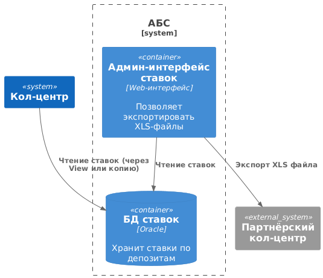

### **Название задачи:**
Предоставление информации по депозитам для кол-центра (банка и партнёрского) в рамках MVP

### **Автор:**
Бирюков Н.А.

### **Дата:**
11-05-2025

### **Функциональные требования**
| № | Действующие лица или системы  | Use Case                      | Описание |
|---|-------------------------------|-------------------------------|----------|
| 1 | Кол-центр                     | Просмотр ставок по депозитам  | Сотрудники должны видеть актуальные ставки для консультации клиентов |
| 2 | Партнёрский кол-центр         | Получение ставок по депозитам | Партнёрский кол-центр получает XLS-файл с актуальными ставками по согласованному расписанию |
| 3 | Сотрудник бэк-офиса           | Экспорт ставок                | Имеет возможность выгрузить ставки в формате XLS для передачи кол-центрам |

### **Нефункциональные требования**
| № | Требование                                    |
|---|-----------------------------------------------|
| 1 | Безопасность передачи файлов: шифрование и контроль доступа |
| 2 | Актуальность данных: ставки должны обновляться не реже раза в день |
| 3 | Простота интеграции: решение не должно требовать доработки API сторонних систем |
| 4 | Использование текущих процессов XLS и минимизация изменений в АБС |
| 5 | Централизация источника данных о ставках — в АБС или в отдельном сервисе при необходимости |

### **Решение**
#### Диаграмма контекста (C4 - Context)

#### Диаграмма контейнеров (C4 - Containers)

### **Альтернативы**
- Разработка REST API для ставок
- Интеграция через FTP/SFTP
- Ручная отправка XLS по email

**Недостатки, ограничения, риски**
- Задержка выгрузки
- Ошибки в XLS
- Невозможность онлайн-доступа внешнего кол-центра

**Список задач по системам**
| Номер | Требования                                            | Система               |
|-------|-------------------------------------------------------|-----------------------|
| T1    | Разработка UI для экспорта данных                     | АБС                   |
| T2    | Ограничение доступа к данным                          | АБС                   |
| T3    | Настройка отображения данных в интерфейсе сотрудников | Кол-центр             |
| T4    | Получение и настройка обработки файлов с данными      | Партнёрский кол-центр |
| T5    | Регламент обновления данных и контроля актуальности   | Партнёрский кол-центр |
